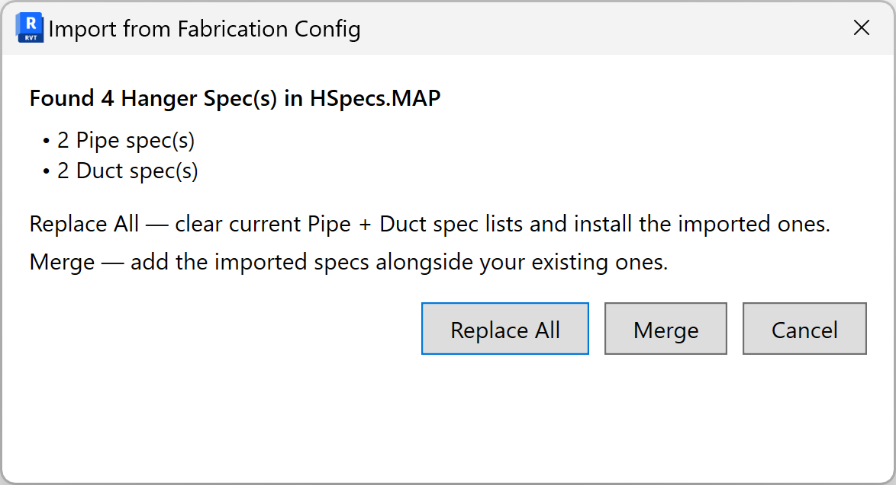
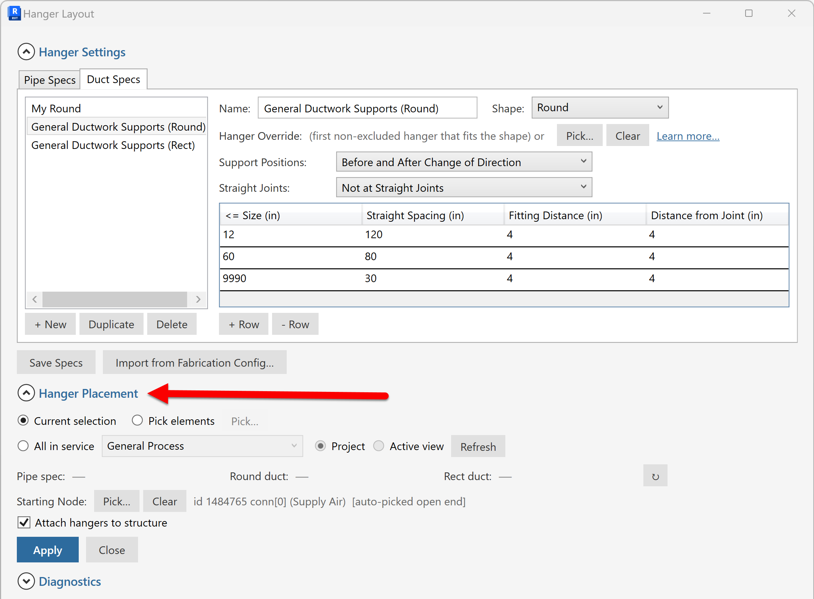

# User guide

A step-by-step walkthrough of every part of the tool. Read top-to-bottom
the first time; jump to a section later.

> **Screenshot status.** Files like `docs/screenshots/01-ribbon-button.png`
> are referenced below. Capture them from your own Revit install and drop
> them in, or [open an issue](https://github.com/sbuchanan01/hanger-layout-for-revit/issues)
> to request that the maintainer fill them in.

---

## Concepts in 30 seconds

- **Support Specification** (or "Spec") — a table of size bands. Each row
  says "for parts up to size X, place hangers every Y feet, with Z setback
  from fittings and W setback from joints".
- **Domain** — Pipe or Duct. Specs are domain-scoped.
- **Duct shape** — within Duct domain, a spec can target Round, Rectangular,
  or Any.
- **Service** — which Revit Piping/Duct *Type* the hanger belongs to. The
  tool reads the available hanger buttons from your active Fab config.
- **Joint** — a coupling, flange, weld, or other small in-line transition
  between two straights. The placer can treat them as transparent (chain
  spans them) or as boundaries (hangers don't sit on joints).

---

## Launching the dialog

After installation, look for the **Hanger Layout** tab in the Revit
ribbon:

Click **Hanger Layout**. The modeless dialog opens:

The dialog is **modeless** — you can keep working in Revit (selecting,
panning, zooming) while it's open.

---

## The three expanders

The dialog body is organized into three collapsible sections:

1. **Hanger Settings** (collapsed by default) — where you define and
   manage your specs.
2. **Hanger Placement** (expanded by default) — the primary workflow:
   pick a service, apply the spec to a selection.
3. **Diagnostics** (collapsed by default) — utility commands for
   investigating Fab catalog quirks. Most users never open this.

---

## Defining specs

Open **Hanger Settings**. There are two tabs:

- **Pipe Specs** — for pipes (and pipe-domain Fab parts).
- **Duct Specs** — for ducts (round and/or rectangular).

### Add a new spec

Click **+ New** below the list. A new spec appears with a default
name. Click the name to rename.

Add size-band rows by clicking **Add Row** under the size-band table:

- **Max Size** — the spec row applies to parts whose nominal size is at
  most this value (in inches).
- **Spacing** — distance between consecutive hangers along a straight
  (inches).
- **Fitting Distance** — setback from a fitting (elbow, tee, etc.) before
  the first/last hanger (inches).
- **Joint Distance** — setback from a joint (coupling, flange, weld)
  before the first/last hanger (inches).

Multiple rows can describe a single spec. The placer picks the row whose
**Max Size** is the smallest value ≥ the part's size.

### Duct shape filter (Duct Specs only)

On the Duct Specs tab, each spec has a **Shape** dropdown:

- **Any** — applies to both round and rectangular ducts.
- **Round** — only round.
- **Rectangular** — only rectangular.

Use this when you want different spacing rules for round vs rectangular
duct (typical — round duct usually allows wider spacing).

### Hanger Override

Below the size-band table, each spec has a **Hanger Override** row:

By default it reads:

> (first non-excluded hanger that fits the shape) or [Pick…] [Clear] [Learn more…]

This means the placer will automatically pick a hanger button that's
compatible with the part's shape. Click **Learn more…** for the full
selection precedence — short version:

1. Hanger names containing **ROUND** or **PIPE** are preferred for round
   hosts.
2. Names containing **RECTANGULAR**, **BEARER**, or **TRAPEZE** are
   preferred for rectangular hosts.
3. Otherwise, the first non-excluded hanger in the service is used.

If you want to pin a specific hanger, click **Pick…** to choose one from
the service's hanger buttons. Click **Clear** to revert to auto.

### Save your specs

Click **Save Specs** at the bottom. Specs are written to ExtensibleStorage
on the project and persist across save/close.

The dialog tracks unsaved changes — if you close it with edits unsaved,
it prompts you.

---

## Importing from Fabrication Config

If you already have hanger specifications defined in Autodesk Fabrication
ESTmep / CADmep / CAMduct, you can import them directly.

Click **Import from Fab** (in Hanger Settings):

On first use, you'll get a file picker — browse to your Fab Database
folder and pick `HSpecs.MAP`. The tool remembers the folder, so subsequent
imports skip the prompt.

You'll get a choice dialog:

- **Replace All** — clears the current domain's specs and installs the
  imported ones. Existing specs are lost.
- **Merge** — keeps existing specs and adds the imported ones. Duplicate
  names get suffixed.
- **Cancel** — leaves everything alone.

Imported specs are marked dirty — review them and **Save Specs** to
commit.

---

## Applying specs

Open **Hanger Placement**.

### 1. Choose a selection method

There are three ways to tell the tool which fabrication parts should
receive hangers. They are mutually exclusive — pick one.

**Current selection** *(default)* — uses whatever fabrication parts you
already have selected in Revit when you hit Apply. Because the dialog is
modeless, you can keep adjusting the Revit selection (window-select,
ctrl-click, Tab-cycle) without closing the dialog. If nothing is
selected when you Apply, the status line tells you so and nothing is
placed.

**Pick elements** — click the **Pick…** button next to this radio. The
dialog hides itself while you pick parts using the standard Revit
element-picker (single-click, ctrl-click for multiple, Esc to finish).
When you finish picking, the dialog reappears and remembers the picked
set. The picked set replaces whatever was previously chosen, so you can
build it up across multiple Pick… clicks only by ctrl-picking within a
single picking session.

**All in service** — the placer pulls every fabrication part whose
Service matches the one chosen in the adjacent dropdown. Useful when
you've designed the whole project under a single Service ("Plumbing —
DCW", "Supply Air Round", etc.) and want a project-wide pass.

When **All in service** is active, two scope radios become enabled:

- **Project** — every part on that Service in the whole model,
  regardless of which view you're in or what's cropped out.
- **Active view** — every part on that Service that's visible in the
  current view (respects view range, crop region, visibility/graphics
  overrides, and worksets). Useful when you've isolated a riser, a
  single floor, or a specific equipment area and want to apply hangers
  to just that scope.

Both scope radios are greyed out for **Current selection** and **Pick
elements** modes — the selection itself already defines the scope in
those cases.

### 2. Pick the specs to apply

- **Pipe Spec** dropdown — pick which Pipe Spec to apply to selected
  pipes.
- **Round Duct Spec** dropdown — pick a spec to apply to selected round
  ducts.
- **Rect Duct Spec** dropdown — pick a spec to apply to selected
  rectangular ducts.

If your target set only contains pipes, the duct dropdowns are ignored
(and vice versa). The **↻** button next to the dropdowns re-detects what
part types are in the current target set, useful if you've changed
modes or selections.

### 3. Starting Node Selection

Because the placer can put setbacks before *and* after fittings, it
needs to know which end of a run is "the start" — that's how it knows
which side gets the clean start of the spacing rhythm and which side
absorbs any leftover slack at the end.

There are two ways to tell it:

**Manual: Pick…** — click **Pick…** next to **Starting Node**, then
click on the part at the end of one run you want to start from. The
flow-map orients that chain to that side. Use **Clear** to remove.
This is the most precise — wins over the auto rule below if both are
set — but it only applies to chains the picked element belongs to.
For a single run, this is the simplest control.

**Automatic: Use Mechanical Equipment as Start** — when checked, the
placer walks outward from each chain's endpoints through the connector
graph (across fittings, valves, transitions, up to a sensible hop
limit) looking for a Mechanical Equipment family instance. Whichever
end reaches one first becomes the start. This is the **recommended
default for multiple runs at once** — pick a service (or window-select
a bunch of risers), turn this on, and every chain self-orients from
its source equipment without you picking one Start Node per chain.

A few notes on the auto rule:

- "Mechanical Equipment" means the Revit category — pumps, boilers,
  AHUs, RTUs, chillers, tanks. Not plumbing fixtures or air terminals.
- Chains that **don't** reach a Mech Eq within range silently fall
  back to the "placer picks an end automatically" behavior.
- Chains where **both** endpoints reach Mech Eq at the same distance
  (equipment-to-equipment runs of similar length) also fall back to
  auto — better than silently picking one arbitrarily.
- The setting persists across Apply runs and sessions.
- After Apply, the status line reports the breakdown — e.g.
  *"Chains oriented: 8 from Mech Eq, 2 from Start Node, 1 auto"* —
  so you can verify the rule fired where you expected.

Use a manual Start Node pick when you want to override per-Apply.
The two work together: Start Node wins for the run it touches; Mech
Eq handles every other chain.

### 4. Attach hangers to structure

The **Attach hangers to structure** checkbox controls whether the
placer hands the resulting hangers to Revit's standard structural-
attachment behavior. When checked, Revit extends each hanger's rod
upward and attaches it to the nearest overhead structural framing
(slab, beam, brace) where one is in reach. Hangers in areas without
nearby structure are still inserted but left unattached.

This is exactly the same behavior as Revit's built-in **Place a Hanger**
command — see Autodesk's documentation under
*Revit Help → MEP → Hangers* for the structural-attachment rules
(reach distance, host categories, what counts as "nearby") since the
add-in uses the Revit API for this and doesn't override that logic.

Leave it off if you want hangers placed in space and intend to attach
them by hand later, or if your model doesn't yet have the structural
framing modeled.

### 5. Skip hangers placed too close together

The **Skip hangers placed within [X] in. of another** checkbox handles
a real edge case in the spacing math: when a spec has both a regular
"every Y feet" interval **and** a "Z inches from a fitting / joint"
setback rule, those two rules can independently demand hangers that
end up uncomfortably close together.

Concrete example. Say your spec is **8' spacing** with an **8" joint
setback**. You have a run with a reducer somewhere in the middle. The
placer walks start-to-end:

- Hanger 1 lands 8" past the upstream fitting.
- Hanger 2 lands 8' past Hanger 1 (correct rhythm).
- The joint-setback rule then *wants* to add a hanger 8" before the
  reducer — but if Hanger 2 already happens to sit close to that
  location, you end up with two hangers only a few inches apart.

When this checkbox is on, the placer walks the chain start-to-end and
drops any candidate position that lands within your specified distance
of an already-kept hanger. **The earlier (start-side) position always
wins**, which is usually what you want — the regular-rhythm hanger
stays put, and the redundant joint-setback candidate gets skipped.
Placement picks back up cleanly on the downstream side of the joint.

A few notes:

- The threshold is **inches**, and it applies project-wide (all specs,
  all domains).
- Default value is **6"** when first enabled. Adjust to whatever your
  organization treats as "too close" — common values are 6"–12".
- The setting persists with the project. Once you turn it on and set a
  value, it stays put across Apply runs and Revit sessions.
- Leaving the checkbox off preserves the strict spec behavior: every
  rule that demands a hanger gets one, even if two end up adjacent.
- Status line after Apply will report any positions that were skipped
  by this rule.

If you're not seeing the issue described above in your work, leave it
off — there's no downside to the strict behavior when your specs don't
produce conflicting hanger requests.

### 6. Click Apply

The placer runs in a single transaction. You'll see:

- Hangers appear in the model at the computed positions.
- A status line at the bottom of the dialog tells you how many were
  placed (and how many were skipped, if any).

---

## Hanger Settings — what each setting does

Beyond the per-spec rows, the Hanger Settings expander has a few
project-wide controls:

### Joint mode

- **Don't span joints** — hangers don't sit at joints; if a chain spans
  multiple straights via couplings/flanges, each straight gets its own
  hanger pattern.
- **Span across joints** (recommended for most workflows) — hangers
  space continuously across joint pieces, treating the joint as a small
  gap.

### Excluded hangers

The auto-picker skips any hanger button that's been marked **Excluded**
in Fabrication itself — the "X" overlay you see on a button's tile in
ESTmep / CADmep / CAMduct. This is also why the default Hanger Override
text says "first **non-excluded** hanger that fits the shape" — the
exclusion is read straight from your Fab database.

There's no in-dialog exclude list. To prevent a specific hanger from
being auto-picked:

1. Open your Fab database in ESTmep / CADmep / CAMduct.
2. Find the hanger button, right-click → Exclude (or whatever your local
   workflow calls it — UI varies by Fab version).
3. Save the Fab database.
4. Restart Revit so it re-reads the updated service.

If you want to override the auto-pick for just one spec without touching
the Fab database, use the **Pick…** button on that spec's Hanger
Override row (see [Hanger Override](#hanger-override) above) — that
pins a specific button regardless of exclusion status.

---

## Diagnostics expander

Power-user / debug commands. Most users never need this.

- **Dump HSpecs.MAP** — write the parsed contents of `HSpecs.MAP` to a
  text file for inspection. Useful when an Import doesn't pull what you
  expected.
- **Dump SUPPORT.MAP** — same for the broader Support map (links hanger
  components to specs).

These write to a path you choose via a Save dialog.

---

## Frequently asked

### "I picked a Service but no hangers appeared after Apply."

Likely one of:

- The selection has no straight parts in it (the placer skips fittings).
- The Service has no compatible hanger buttons. Open the Hanger Override
  for the spec and try Pick… to see what's available.
- The spec has no size-band rows. Add at least one.

### "Hangers ended up on top of fittings."

Check the **Fitting Distance** and **Joint Distance** values on the spec
row that matched the part's size. Setbacks may be set to 0 or smaller
than your fittings.

### "Spacing seems off by a few inches on chains with flanges."

The placer accounts for the flange's own length in the chain spacing.
If you see a small offset:

- Verify the flange piece is a fabrication "joint" type (coupling,
  flange, weld). Custom joint families may not be recognized.
- Open Diagnostics → Dump SUPPORT.MAP to see how Fab classifies the
  piece.

### "Round and Rectangular duct specs both apply to a mixed run."

Each duct in the selection gets routed to its own spec based on shape.
A single chain with a Round → Rect reducer gets Round-spec hangers on
the round side and Rect-spec hangers on the rect side. If you want both
sides to use the same spec, set the Shape on that spec to **Any**.

### "How do I share specs across projects?"

Currently specs live on the project. Workarounds:

- Use the Import from Fab feature so your team's Fab `HSpecs.MAP` is
  the source of truth.
- A JSON export/import feature is on the backlog —
  [contributions welcome](https://github.com/sbuchanan01/hanger-layout-for-revit/issues).

---

## Reporting bugs and asking for features

[GitHub Issues](https://github.com/sbuchanan01/hanger-layout-for-revit/issues).

When reporting a placement bug, please include:
- Revit version + build number (Help → About).
- A screenshot of the dialog with the relevant spec visible.
- A minimal sample model (or a description of the part configuration).
- What you expected, what happened.
